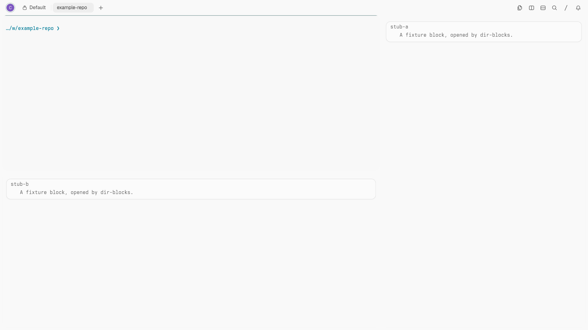

# Tern dir-blocks

[](https://github.com/charliemartin0/tern-dir-blocks/actions/workflows/ci.yml)
[](LICENSE)

Map directories to plugin blocks in [Tern](https://docs.stencil.so/tern/). When a pane's working directory enters a configured directory, Tern opens that directory's blocks (`jira`, `graphite`, …) beside the shell, once per tab.



## Requirements

- Tern 0.6.0 or newer.
- The plugins whose blocks you map (for example [jira](https://github.com/charliemartin0/tern-jira) and [graphite](https://github.com/charliemartin0/tern-graphite)), installed on the same machine as the pane. For a [host rule](#remote-hosts) that is the remote host: Tern opens a split on the pane's host, and only that host's Ready plugins can supply the block. dir-blocks itself has no host half, so it is only installed on the machine running the window.

## Install

```sh
git clone https://github.com/charliemartin0/tern-dir-blocks.git
cd tern-dir-blocks
tern plugin link .
```

Linking loads the plugin into the daemon and existing windows; no Tern restart is needed. The plugin has no host half and does nothing at load beyond registering its event, commands and status segment. The first directory change (or command) in a window reads `config.json`, writing a default one with no rules if there is none (see [Config](#config)). Run `tern plugin types .` to regenerate `tern.d.luau` after a Tern SDK update.

## What it does

- **Auto-open**: a pane `cd`s into a directory that matches a rule, and the rule's blocks open in that pane's tab, beside the pane, without taking focus.
- **Once per tab per rule** (default): `cd`-ing around inside the directory, leaving it and coming back, or a second pane entering it opens nothing more. A block that is already in the tab is never opened again. Closing a block does not bring it back on the next `cd`; leaving a directory never closes anything unless `close_on_leave` is enabled.
- **Optional close on leave**: set `"close_on_leave": true` to close blocks this plugin opened when the last local, non-floating shell in their source tab leaves the rule's directory. Subdirectories still count as inside. Re-entering opens the blocks again, subject to the existing limits. Blocks already open before the rule ran are never closed. This includes blocks opened by the manual command and blocks placed in another tab; only the owned block closes, not other panes added to that tab.
- **Remote hosts (opt-in)**: a rule with `"host"` applies to panes on that attached remote host instead of this machine; see [Remote hosts](#remote-hosts).
- **Most specific path wins**: with rules for `~/code/repo` and `~/code/repo/api`, a pane in `~/code/repo/api/handlers` gets only the `~/code/repo/api` blocks.
- **Manual and switch**: the palette commands **Open blocks for this directory** (`plugin.dir-blocks.open_now`) and **Toggle directory auto-open** (`plugin.dir-blocks.toggle`). **Directory blocks: show status** (`plugin.dir-blocks.status`) lists the state and any problems.
- **Status line**: nothing while all is well; `dir-blocks off` (click to toggle) while auto-open is off; `dir-blocks !` (click for details) while a rule has a problem.

## Config

`config.json` lives in the plugin's data directory (Linux: `~/.local/state/tern/plugin-data/dir-blocks/config.json`, or `$TERN_CONFIG_DIR/plugin-data/dir-blocks/` when that is set). It is first read on a window's first directory change, then re-read on every directory change, so edits apply immediately. `tern.fs` has no mtime, so the parsed config is cached against the file's text and only re-parsed when that changes. JSON has no comments, and the file must be a regular file: Tern refuses to read a symlink there, which then shows as a config problem.

Example: `~/code/my-project` opens `jira` on the right and `graphite` below it, also on the right:

```json
{
  "auto_open": true,
  "close_on_leave": false,
  "max_opens_per_minute": 6,
  "max_blocks_per_tab": 8,
  "rules": [
    {
      "path": "~/code/my-project",
      "blocks": [
        { "block": "jira", "place": "right" },
        { "block": "graphite", "place": "down", "of": "previous" }
      ]
    }
  ]
}
```

### Keys

| Key | Default | Notes |
|---|---|---|
| `auto_open` | `true` | Auto-open on `cd`. The **Toggle** command overrides it for every window; toggling back to what this key says returns control to it. |
| `close_on_leave` | `false` | Close this plugin's blocks after leaving their directory; re-entering reopens them. Only blocks opened while this option is on are tracked. Turning auto-open off also pauses automatic closing. |
| `max_opens_per_minute` | `6` | Auto-opens per window per minute, clamped to 1–60. Further opens wait for the next `cd` after the minute passes. |
| `max_blocks_per_tab` | `8` | Hard cap on blocks this plugin opens in one tab, clamped to 1–16. The manual command obeys it too. |
| `rules` | `[]` | At most 64 rules. |

### Rules

| Key | Notes |
|---|---|
| `host` | Optional. Without it the rule matches panes on this machine only (as before). With it, only panes on that remote host: its name as Tern shows it (case-insensitive), its exact address, or the address without `user@` and `:port` (so `"desktop-wsl"` matches `charlie@desktop-wsl`). See [Remote hosts](#remote-hosts). |
| `path` | Required. Absolute, or starting with `~/` (or exactly `~`); a `host` rule must be absolute, because `~` expands to this machine's home. Matches the directory itself and everything below it, not siblings that merely share a prefix (`/a/b` does not match `/a/bc`). `.`, `..`, `//` and a trailing `/` are normalized. Symlinks are not resolved: the path the shell reports is what matches. `/` is refused. A repeated path is ignored. |
| `blocks` | Required, 1–8 entries. Each is a string (`"jira"`) or an object. |

A repeated path means the same `host` (or none) and the same path: a local rule and a host rule may share a path.

### Remote hosts

Rule paths belong to one filesystem, so rules are split by host. A rule without `host` is about this machine's panes, exactly as before: a pane on a remote host never matches it. A rule with `host` matches only shells on that host, using that host's absolute paths:

```json
{
  "path": "/home/me/Dev/my-project",
  "host": "desktop-wsl",
  "blocks": [
    { "block": "jira", "place": "right" },
    { "block": "graphite", "place": "down", "of": "previous" }
  ]
}
```

- **Specificity is per host**: only the rules for the pane's host compete, so a longer host rule never shadows a local rule for a local pane, and a local rule never fires for a remote pane.
- **The blocks come from the remote host**: a split runs on the pane's host, so the mapped plugins must be installed and Ready there (`tern plugin list` on that machine), with whatever credentials they read in that host's daemon environment. A missing one shows as `no block …` in the status.
- **The window must be showing that host**: Tern lists block types for the host the window currently shows. If a remote pane changes directory while the window shows another host (a background session), the rule waits and opens on that pane's next `cd` while its host is shown. One `info` line is logged.
- **Once per tab, limits and `close_on_leave`** work as for local rules. Close-on-leave for a host rule only counts shells on that host, and a pane only closes blocks of rules for its own host.

### Block entries

| Key | Default | Notes |
|---|---|---|
| `block` | — | A plugin id (`"jira"`, which must have exactly one block) or a full block kind (`"jira.issues"`; use it when a plugin has several). |
| `place` | `"right"` | `"right"` or `"down"`: split the pane that entered the directory. `"tab"`: a new tab in the same session and window. |
| `ratio` | `0.5` | Share of the split the new block takes, 0.1–0.9. Ignored for `"tab"`. Tern's API moves dividers by whole cells, so the result is within about a cell of the ratio. |
| `of` | `"shell"` | What to split. `"shell"`: the pane that entered the directory. `"previous"`: the block opened just before this one in the rule (or already open in the tab), which is how two blocks stack on one side. Not allowed on the first entry or with `"tab"`. If the previous block is missing, the shell is split instead and a warning is logged. |

Entries open in order. With the default `of`, each splits the shell, so `jira` right then `graphite` down gives the shell the top left, `graphite` the bottom left and `jira` the right. With the example above, `graphite` splits `jira` instead: the shell keeps the whole left side and `jira` sits on top of `graphite` on the right.

## How it listens

Tern's window half of a plugin can subscribe to window events directly. `tern.d.luau` documents `tern.on(name, fn)` for `focus`, `pane_created`, `pane_closed`, `tab_created`, `tab_closed`, `command_started`, `command_finished`, `cwd` and `title`, and defines the payload `CwdEvent { pane, path }`. So `window.luau` does:

```lua
tern.on("cwd", function(ev: CwdEvent, cx: WindowCx)
```

There is no need for the fallbacks:

- The host half also gets `cwd`, but only with an `EffectCx` (toast, open, copy). It cannot split a pane or open a tab; `WindowCx.layout` can.
- A Carly task with `on = "cwd"` is a durable model-scheduled task with a 12-hour default expiry and a Luau `check` string, not a plugin hook.
- The `spawn` hook runs before a pane exists and only sees the starting directory, not later `cd`s.

The `cwd` event fires when the shell reports a new directory, once per `cd` (also once when a pane starts). With auto-open enabled, the engine reads config and matches the directory. If `close_on_leave` is enabled, it first closes owned blocks for directories the tab's local, non-floating shells have left. It then opens any matching rule entries not already done or visible. Only non-floating terminal or agent panes trigger either action, and only for rules about their host (no `host`: this machine; with `host`: that host); blocks never do. The window half receives `cwd` for every pane in the window, remote ones included (the SDK's layout guide: "Events describe what this window's session saw, remote hosts' panes included").

## Safety

- **No new windows**: blocks open only through `layout:split` (beside the pane) and `layout:new_tab` (this window and session). Nothing else opens anything.
- **Only your host**: a rule without `host` never acts on a remote pane, and a `host` rule never acts on another host's panes; existing configs keep their exact behaviour.
- **Only configured blocks**: only the winning rule's blocks, each at most once per tab until optional close-on-leave forgets them. A block already in the tab is skipped. Blocks the plugin opened never trigger more opens (only shells do), so a `tab` rule cannot chain.
- **Limits**: `max_opens_per_minute` (auto only) and `max_blocks_per_tab` (auto and manual).
- **Bad config or a missing plugin never breaks anything**: a bad rule or entry is skipped and the rest keep working; an unknown, ambiguous or failing block is skipped and logged once. Every entry point is wrapped so no error reaches Tern.
- **Problems are visible** in two places, once a window has read `config.json` (its first directory change or command; `tern plugin list` does not report config problems, because the plugin does no config work at load):
  - **The Tern log** (`STENCIL_LOG=warn,tern::plugin=info`): each distinct problem once, prefixed `dir-blocks:`, plus one `info` line per block opened.
  - **The status line and the status command**, live: config problems and runtime ones (plugin not installed or ambiguous, a split that Tern refused).

## Limits

- Plugin blocks only (anything in `cx.session:block_types()`).
- A remote pane only triggers rules that name its host (`"host"`). Those rules need absolute paths, the plugins installed on that host, and the window showing that host (see [Remote hosts](#remote-hosts)).
- The once-per-tab memory and close-on-leave ownership live in the window's plugin VM: a plugin reload or a Tern restart forgets them. The already-in-the-tab check still stops duplicates; a block you closed would open again on the next `cd` into the directory. Blocks surviving a reload are not subsequently auto-closed because their ownership is no longer known. Use the toggle if auto-opening bothers you.
- The per-tab cap counts opens since the window started, minus blocks forgotten by close-on-leave; manually closing a block does not immediately free its slot. The per-minute limit still counts opens even if their blocks were auto-closed.
- Symlinked directories match under the path the shell prints.
- `"tab"` placement uses `layout:new_tab`, which takes no session argument: the tab opens in the session the window shows, which is the pane's own unless a pane in a background session changes directory.

## Testing

Unit tests run the real `config.luau` and `engine.luau` against a fake window (no Tern needed) with the [Luau CLI](https://github.com/luau-lang/luau/releases):

```sh
luau-compile --null config.luau engine.luau window.luau
luau test/test.luau
```

They cover path matching and specificity, config validation, enter-once and cd-around, already-visible, tab and manual behavior, rate limit and per-tab cap, ratio, missing/ambiguous plugins, and close-on-leave ownership, multiple shells, nested directories, re-entry and failures at boundaries, and host rules (validation, matching by name and address, wrong host, local rules unaffected, per-host specificity, waiting for the host to be shown, manual command, close-on-leave).

`test/e2e.sh` is the check in a real window. It starts a private Tern daemon and window (private config, daemon socket, log directory and control socket, so your own windows, plugin links and daemon are untouched), `cd`s into a configured directory, `cd`s around, leaves and returns, runs both commands, tries a bad config, exercises close-on-leave for splits and tab placement, and checks its owned window and private daemon window counts before and after. It needs `tern`, `jq` and a running Hyprland session:

```sh
bash test/e2e.sh
```

Type-check with [luau-lsp](https://github.com/JohnnyMorganz/luau-lsp) against the generated SDK (it needs `userdata`, which the generated file leaves undefined, so a one-line shim file supplies it):

```sh
echo 'declare extern type userdata with end' > /tmp/userdata.d.luau
luau-lsp analyze --definitions=/tmp/userdata.d.luau --definitions=$PWD/tern.d.luau config.luau engine.luau window.luau
```

The screenshot is captured from a private window with `tern ctl --control <socket> shot blocks`, floated and sized to 1536×864 logical pixels at scale 1.25 (1920×1080), not with a desktop grab. It shows the two fixture blocks in `test/fixtures` (`stub-a`, `stub-b`), never live Jira or Graphite data.

## License

[MIT](LICENSE).
